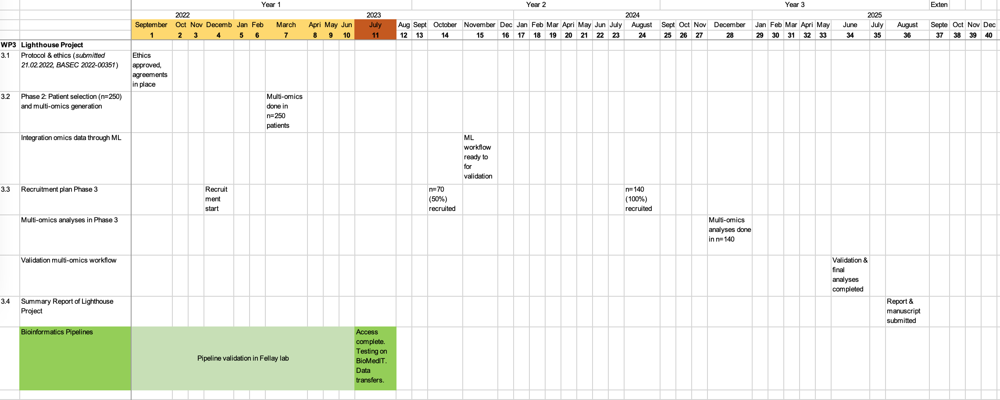

# Progress reports

Last update: 20230707

Author: Dylan Lawless

<!-- {width=70% height} -->
\includegraphics[scale=0.4]{./gant.png}

## Month: 202307 (start date)

### Complete
* SIB security training
    * Responsible use of health data
    * Responsible Use of BioMedIT
* UZH VPN via Kispi
* BioMedIT server access complete:
    * project: MOMIC,  node: sciCOREmed (scicore), University of Basel
    * project: Trans-omic analysis, node: Leonhard Med, Scientific IT Services (SIS), ETH Zurich
* Editor environment: 
    * scicore - done
    * LeoMed - in progress
* Decision on code management
* Decision on containerisation
* completion of SPSS exome paper
* WES pipeline package for BioMedIT

### Planned
* repository imports
* reference database test
* slurm sbatch test
* gitlab test
* snakemake test
* conda/mamba test
* ssh from kispi hardware
* meetings with collaborating groups

 Project start: 20230701

----

## Month: 202306 (pre-start date)
* SIB course on Enrichment Analysis (June 23).
* SPHN DCC workshop on concept development.
* Concept development examples of needs and reference to models: <https://swisspedhealth-pipelinedev.github.io/docs/pages/concepts.html>
* PipeDev - first design doc started: <https://swisspedhealth-pipelinedev.github.io/docs/pages/design_doc/dna_germline_short.html>

## Month: 202305 (pre-start date)
* PipeDev - documentation website v1 live: <https://swisspedhealth-pipelinedev.github.io/docs/pages/variables.html>
* PipeDev - data sources database started: <https://swisspedhealth-pipelinedev.github.io/docs/pages/annotation_table>
* PipeDev - styles defined
* PipeDev - presentation slides

## Month: All older (pre-start date)
* PipeDev - general plan slides: <https://swisspedhealth-pipelinedev.github.io/docs/pages/present/presentations.html>
* PipeDev - git orgnaisation reserved for publications: <https://github.com/SwissPedHealth-PipelineDev>
* PipeDev - git repo started
* SwissPedHealth - website demo v2
* SwissPedHealth - website demo v1

---

